# Cross-Session Aware Temporal Convolutional Network for Session-based Recommendation

## 论文

ICDM 2020 美团技术团队 基于图结构的会话推荐模型

### Background

1. 现有的会话推荐方法都仅仅关注会话的内部信息，忽略了跨会话的影响
2. 在基于图结构的会话推荐方法中，将出现在**不同时间步的相同item**都视为一个节点。这样会丢失序列中的位置信息，以至于不同序列会话构建出相同的图结构。

### Related work

现在基于会话推荐的方法大致分为两类，分别是基于协同过滤和基于深度学习的方法

- 基于协同过滤的方法

  ​		协同过滤方法是在推荐系统中被广泛使用的通用方法，协同过滤方法主要可以分为两大类：基于KNN查找方法和基于相似度建模方法。 

  ​		基于KNN查找方法是通过查找Top-K个相关的users或items来实现推荐，基于KNN查找方法可以通过查找与当前会话中最后一个item最相似的item来实现基于会话的推荐。 最近，KNN-RNN[6]探索将RNN模型与KNN模型相结合，通过RNN模型来提取会话序列信息，然后查找在与当前Session相似的Session中出现的item来实现推荐。

  ​		对于基于相似度建模的方法，CSRM[7]通过记忆网络将距离当前会话时间最近的m个会话中包含的相关信息进行建模，从而来获得更为准确的会话表示，以提高会话推荐的性能。

- 基于深度学习的方法

  ​		对于会话推荐任务而言，循环神经网络RNN是一个直观的选择，可以利用其提取序列特征的优势来捕获会话内复杂的依赖关系。**GRU4Rec**[2]利用门控循环单元（GRU）作为RNN的一种特殊形式来学习item之间的长期依赖性，以预测会话中的下一个动作。之后的一些工作，是通过在基于RNN模型的基础上增加注意力机制和记忆机制等对模型进行了改进和扩展，其中**NARM**[8]探索了一种具有注意力机制的层次编码器，可以对当前会话中用户的序列行为和主要意图进行建模。 最近， 随着图神经网络模型的飞速发展，出现了依赖图结构的会话推荐模型，**SR-GNN**首先提出将每个会话映射为一个图结构，并利用图神经网络模型GNN来建模item之间的复杂转移关系。 之后，**GC-SAN**通过加入Self-Attention机制进一步扩展了SR-GNN模型，从而成为了State-of-the-art的解决方法。

### CA-TAN

跨会话感知的时间卷积神经网络模型

#### 模型整体架构

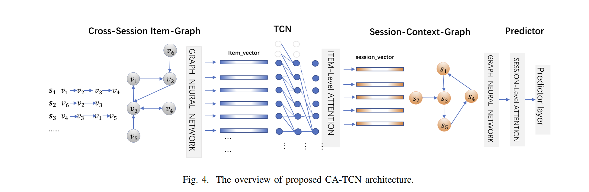

Cross -Session item-Graph: 连接出现在不同会话中且具有关系的item。输出经过图神经网络输出包含全局信息的item向量(Item_vector)

TCN: 输出蕴含会话序列信息的item表示，根据Item-Level Attention机制来整合item的表示进而获得Session表示。

Session-Context Graph:根据Session表示之间的相似度构建Session-Context Graph图以对Session层次的跨会话关系进行建模。

predictor: 根据Session的表示以及item的表示进行预测

#### Cross -Session item-Graph

构建有向图G_item 每个节点代表一个item, $({v_s(i)},{v_s(i+1)})$作为一条边，代表在会话s中用户在${v_s(i)}$之后点击了${v_s(i+1)}$,G_item不仅可以获取会话的内部信息，同时可以得到非当前会话的外部信息。

为了充分利用G_item图结构中的信息，CA-TCN将item的**点击顺序**和**共现次数**考虑在内。

对于点击顺序：建立带有方向的邻接矩阵A_in和A_out来建模输入和输出方向。

对于共现次数：在邻接矩阵的基础上，根据item之间的共现次数为不同的边设置不同的权重，得到权重矩阵Weight_in和Weight_out。通过分配不同的权重，具有更多共现次数的item将发挥更大的作用，反之亦然，从而避免了噪音影响。

接下来，我们开发GNN模型来捕捉复杂的跨会话信息在item__level的影响，GNN将每一个item映射为一个d维的embedding v∈R^d，得到包含跨会话信息的全局item向量（item_vector）。

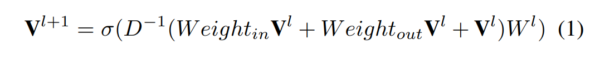

#### TCN-Model

在第二阶段，我们采用时间卷积神经网络TCN来对会话序列进行建模，获取会话s的全局和局部表示。每一个会话s由多个item组成，输入会话s包含的item全局向量化表示（item_vector）到时间卷积神经网络（TCN）模型中。对于会话中的每一个item进行因果和膨胀卷积的计算，进行会话序列信息的抽取。

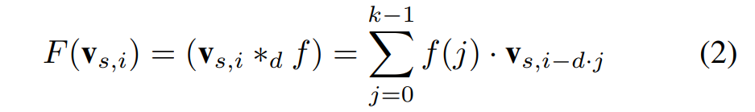

采用会话中最后一个item的TCN输出作为会话s的局部（local）信息，以正确获取用户的当前兴趣：

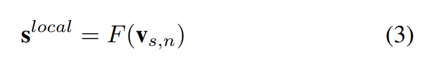

此外，采用会话s包含的items的表示以加权求和的方式得到会话的全局（global）表示（session_vector），捕捉用户的全局信息。其中为了区分不同的item对于会话的影响程度不同，采用item层次注意力机制，使得会话表示更加专注于重要程度高的items。

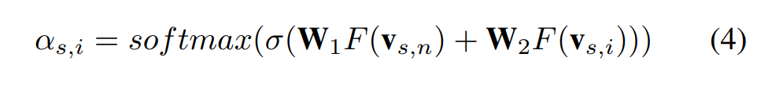

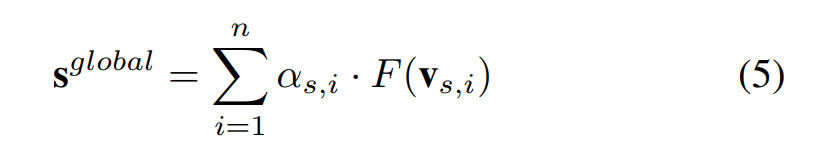

#### Session-Context-Graph

会话的local表示和global表示只专注于当前的会话，而忽略了会话间的影响。为了克服该不足，我们构建一个上下文感知的会话图结构（Session-Context-Graph）来考虑不同会话之间复杂的关系。在会话图中，每一个节点代表一个会话s, **边的链接代表两个会话之间具有相似性**。我们需要考虑的一个重要问题是如何决定一条边是否存在。对于每一对会话，我们计算其二者表示的相似度，然后采用根据相似度值的KNN-Graph[9] 模型来决定一个会话节点的邻居。

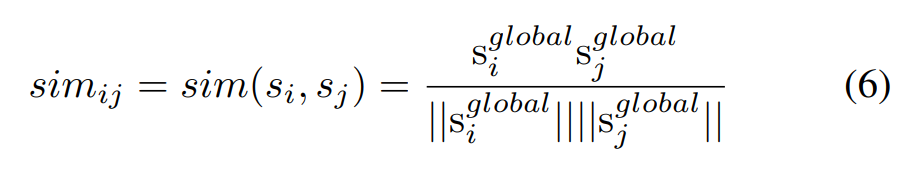

在构建会话图结构之后，我们采用会话层的注意力机制以及图神经网络模型[10]来整合会话邻居节点对其自身的影响，同时会话层的注意力将会话之间的相似度也考虑在内，最终得到基于会话上下文敏感的会话表示。

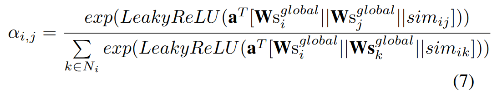

${a_(i,j)代表s_j对于s_i影响的权重}$

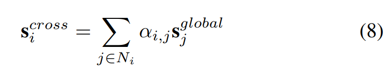

#### predictor

采用融合函数将会话的局部表示，全局表示以及基于跨会话信息的表示进行融合，得到最终的会话表示：

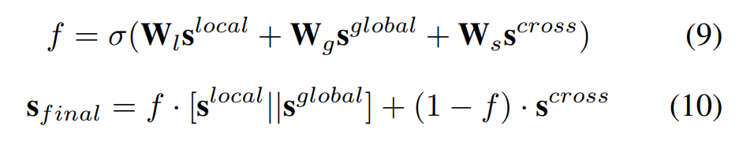

最后，我们根据item和session的表示去预测每一个候选item成为用户下一个点击的概率，根据概率进行逆序排序，筛选出概率值排在前预设位数对应的商品，作为用户偏好商品并进行推荐

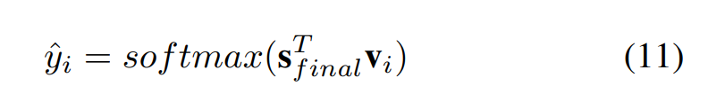

### Experiment

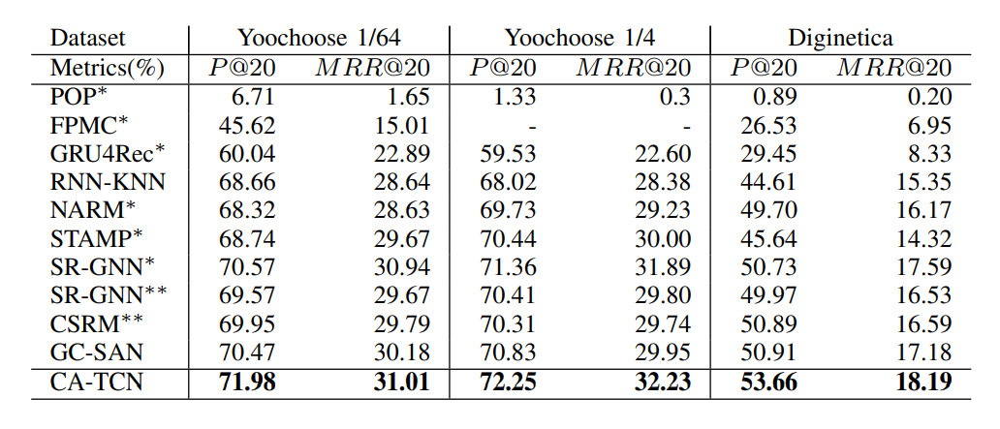
